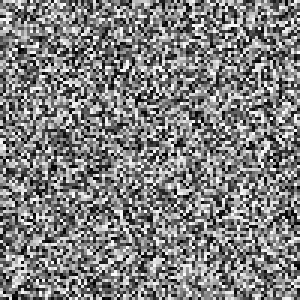
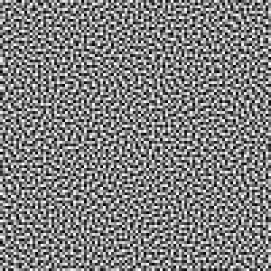
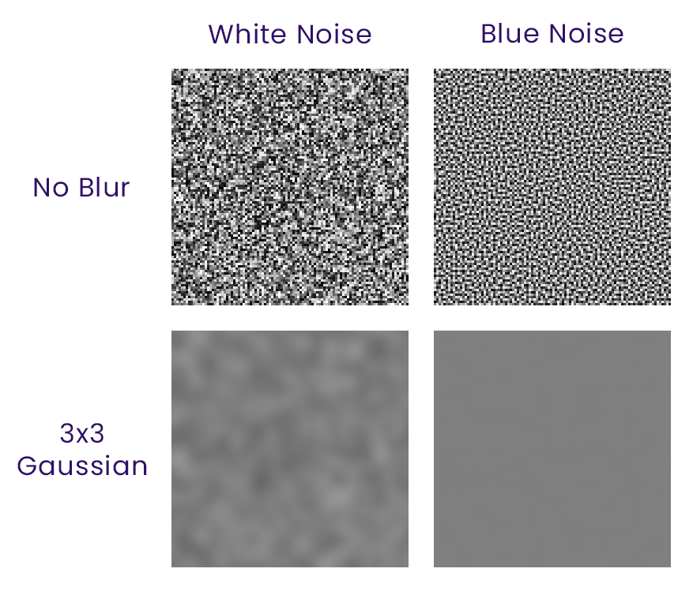

Path Tracing is an amazing light transport model that has been around for a long time. It's physically accurate and captures almost all phenomena we usually *fake* with other rendering techniques. It has also been gaining popularity recently with the rise of ray tracing cores in modern graphics cards and more games utilizing it.

")

However... have you ever noticed the TV-static-like look that usually comes with it? That is called [noise](https://en.wikipedia.org/wiki/Image_noise). Because of the stochastic and computationally expensive nature of Monte Carlo Path Tracing, not every pixel on the screen is lucky enough to reach a light source when using very low sample counts under real-time constraints. But there is *"blue"* noise in the title of this blog, so there are other colors as well? What the hell does that even mean? Well, I'm going to give a surface-level introduction, but I recommend reading [Casey Muratori's article](https://caseymuratori.com/blog_0010) on this later.

Firstly, I generated a noise texture in the most naive way possible. For each pixel, I just choose a pseudo-random value. That's it. This is what we can use in our random sampler in the path tracer.

This is called white noise. It isn't necessarily pleasant to look at, it has clumps of black in some areas, big open gaps in other areas and similar artifacts you'd expect from a purely random noise texture caused by varying frequency everywhere. However, what if we want a better *"TV static"* in our Path Tracer? Meet blue noise:

Isn't this suddenly much, much better to look at? The noise is still random, but it has some correlation. It appears that blue noise is not just nicer to look at, but also blurs *faster*. This means a spatial denoiser would have a better time with blue noise, because it suppresses low-frequency artifacts compared to white noise. You can see the difference when I apply a 3 pixel radius Gaussian blur to both noise textures:

Awesome! Let's implement it then… but not so fast. Because there is a small road block I've hit here. A blue noise texture you can find online or generate yourself is at most a 2D RGBA texture. This means, for each pixel, you only have 4 dimensions of blue noise value.

Let's step back and think of how a simple Path Tracer fetches random values for sampling. When a ray reflects, it needs two values to construct a random hemisphere. But it also can have multiple samples per pixel. And on top of that, temporal accumulation or progressive rendering adds one more layer. And in the end, we are in need of a multidimensional random "value", and the simple 2D RGBA texture just doesn't cut it.

This is where I came across Eric Heitz's research paper about [distributing Monte Carlo error as blue noise on the screen](https://eheitzresearch.wordpress.com/762-2/). This blog is not about technical details, so if you're curious about that please read Heitz's original work. But basically, they provide a sampler which you can plug in place of your path tracer's sampler, and your spatial noise _**math-magically**_ becomes blue noise! I was incredibly happy and excited when I saw the results after implementing it. Here's my findings using a naive PRNG sampler and Heitz's bluenoise sampler:

")

The scene I used has many colored light sources with complex-enough geometry. So the difference may or may not be immediately apparent like the flat 2D noise textures, but you can clearly see the clumping mostly going away in areas where light is concentrated. I've been playing around with the technique for a while, and it's been *really* helping the final image generated by my Path Tracer.

")

There seem to be other approaches and advancements such as the Z-sampler, Nvidia's Spatiotemporal Blue Noise, etc… However, I'm currently happy with my implementation of Heitz's solution. There are some slight disadvantages compared to regular sampling, for example, in my implementation I had to switch back to PRNG after I exhausted the ranking data they have provided, which is only 8-dimensional. This might also be my fault for interpreting the paper incorrectly.

But I hope that, at the end of the day, I was able to give you a good overview of Path Tracing sampling methods and how noise can impact the final image!

**Bonus**: I've wrote a script that generates SSBO data provided by Heitz's paper to be used easily. [Check it out here](https://github.com/kadir014/iris-heitz-bluenoise-gen). If you're also working on a Minecraft shaderpack, the generated files are Iris-ready in std430 layout.

## References
- E. Heitz et al. [Low-Discrepancy sampler using Owen-scrambled Sobol sequence for Bluenoise](https://eheitzresearch.wordpress.com/762-2/)
- Casey Muratori, [The Color of Noise](https://caseymuratori.com/blog_0010)
- Demofox, [What the Heck is Blue Noise?](https://blog.demofox.org/2018/01/30/what-the-heck-is-blue-noise/)